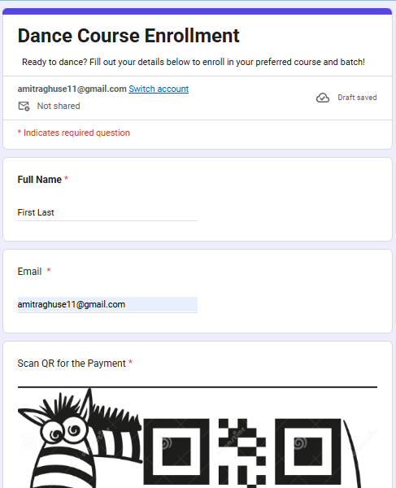
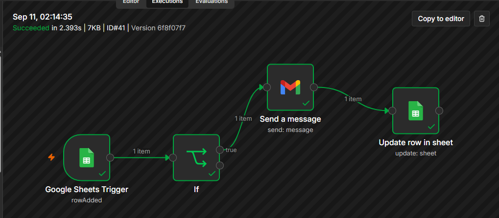
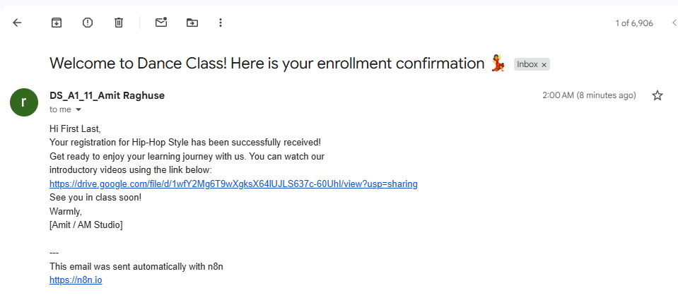

# 💃 Dance Course Enrollment Automation

An automated dance course enrollment and confirmation system built using **Google Forms, Google Sheets, n8n, and Gmail**.

The system allows students to submit their enrollment details through a Google Form and automatically receive a personalized confirmation email after their response is recorded in Google Sheets.

---

## 📸 Project Demo

### Google Form



### n8n Workflow



### Google Sheets


### Gmail Confirmation



---

## 🚀 Features

- Collect dance course enrollment details through Google Forms
- Collect student's full name and email address
- Provide payment instructions and QR code through the Google Form
- Automatically store form responses in Google Sheets
- Detect new enrollment responses using n8n
- Check whether the confirmation email has already been sent
- Automatically send personalized confirmation emails through Gmail
- Include the student's name in the confirmation email
- Include course information in the confirmation email
- Update the Google Sheets record after sending the email
- Track email status using the `Mail Sent` field
- Prevent repeated confirmation emails for the same enrollment

> **Note:** The payment QR code/instructions are part of the Google Form enrollment process. This n8n workflow does not process or verify payments.

---

## 🏗️ Workflow Architecture

```text
Google Form
     │
     ├── Full Name
     ├── Email
     └── Payment QR / Instructions
     │
     ▼
Google Sheets
     │
     ▼
Google Sheets Trigger
     │
     ▼
IF
     │
     └── Check "Mail Sent"
              │
              ▼
       Send Gmail Message
              │
              ▼
       Update Google Sheets
              │
              ▼
          Sent ✔️
```

---

## 🔄 How It Works

1. The student opens the Dance Course Enrollment Google Form.
2. The student enters their full name and email address.
3. Payment instructions and the QR code are provided through the Google Form.
4. The submitted form response is automatically stored in Google Sheets.
5. The Google Sheets Trigger in n8n detects the new response.
6. The `If` node checks whether the `Mail Sent` field is empty.
7. If the email has not been sent, n8n sends a personalized confirmation email through Gmail.
8. After the email is sent, n8n updates the corresponding Google Sheets row.
9. The `Mail Sent` field is updated to `Sent ✔️`.

---

## 📊 Google Sheets Structure

The Google Form responses are stored in a linked Google Sheet.

| Timestamp | Full Name | Email | Mail Sent |
|-----------|-----------|-------|-----------|
| 2026-09-11 14:00:20 | Test Student | test@example.com | Sent ✔️ |

The `Mail Sent` field is used to track whether the enrollment confirmation email has already been sent.

---

## 📧 Automated Gmail Confirmation

When a new enrollment is detected, the workflow automatically sends a confirmation email to the student's submitted email address.

### Example

**Subject:**

> Welcome to Dance Class! Here is your enrollment confirmation 💃

**Email:**

> Hi Test Student,
>
> Your registration for Hip-Hop Style has been successfully received!
>
> Get ready to enjoy your learning journey with us.
>
> You can watch our introductory videos using the link provided in the email.
>
> See you in class soon!

The student's name is dynamically taken from the Google Sheets response.

---

## 🧠 Conditional Automation

The workflow uses an `If` node to check the `Mail Sent` field before sending the confirmation email.

```text
Mail Sent is empty?
       │
   ┌───┴───┐
  YES      NO
   │        │
   ▼        ▼
Send      Stop
Email
   │
   ▼
Update
Sheet
```

This prevents the workflow from sending another confirmation email when the `Mail Sent` field already contains a value.

---

## 🛠️ Technologies Used

- **Google Forms** — Student enrollment form
- **Google Sheets** — Form response storage
- **n8n** — Workflow automation and conditional logic
- **Gmail** — Automated email communication

---

## ⚙️ Setup

### 1. Create the Google Form

Create a Google Form for dance course enrollment with fields such as:

```text
Full Name
Email
Payment QR / Instructions
```

### 2. Link Google Forms to Google Sheets

Connect the Google Form to a Google Sheets spreadsheet so that submitted responses are automatically recorded.

### 3. Import the n8n Workflow

Import the provided workflow JSON into your n8n instance.

### 4. Configure Google Sheets

Connect your Google Sheets credentials and select your own form-response spreadsheet.

### 5. Configure Gmail

Connect your Gmail credentials to the Gmail node.

### 6. Activate the Workflow

Activate the workflow and submit a test enrollment through the Google Form.

The expected flow is:

```text
Google Form
     ↓
Google Sheets
     ↓
n8n
     ↓
Gmail Confirmation
     ↓
Mail Sent = Sent ✔️
```

---

## 🔐 Security

Do not commit API keys, passwords, OAuth secrets, or other sensitive credentials to this repository.

The workflow file provided in this repository should contain sanitized configuration only.

Real student information and private payment details should not be included in the repository.

---

## 🔮 Future Improvements

- Payment verification integration
- Automated payment-status tracking
- Multiple dance course support
- Course and batch selection
- Automated enrollment reminders
- Admin notification emails
- Enrollment confirmation PDF
- Student database integration
- Attendance management
- Automated follow-up emails

---

## 👨‍💻 Project

Built as a practical project to explore:

**Workflow Automation + Google Forms + Google Sheets + Gmail + n8n**
